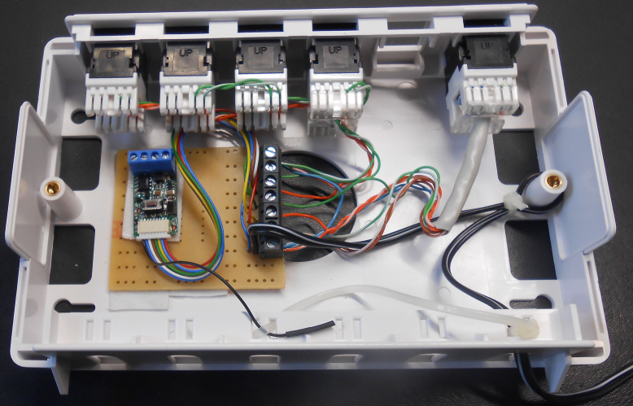
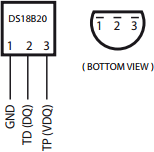

Space for my wiring diagrams that did not make it to the application pages (yet)

h2.Fibaro Universal sensor

For the wiring I did use CAT 5 cable. As I happened to have some spare ethernet patch boxes and some Keystone jacks (rj45), I used these for mounting the Fibaro Universal sensor. This box is designed for the control of my [Somfy sunscreens](http://www.openremote.org/display/~pz1/OpenRemote+2.0+How+To+-+Interface+Hydreon+RG-11+Rain+Sensor+-+Fibaro+Universal+Sensor).

h3.Temperature Sensors

At the upper side of the image at the left (click for full size) you see four connectors. These connectors are daisy chained to temperature sensor wires of the Fibaro using the *T-568B* wiring schema.
Wire 3 (green/white) is connected to *GND* (the blue wire next to the antenna). Wire 2 (orange) connects to *TP(VDQ)* (brown wire from Fibaro). Wire 6 (green) connects to *TD(DQ)* (white wire from Fibaro).

h3.Binary Sensors
At the right in the box there is one connector to serve both binary sensors. One for the [Rain Sensor](http://www.openremote.org/x/vCBdAQ), the other for a switch that signals whether the sunshades are in their docking position or not. 
For the power connection I follow 'the' POE convention where the blue wire pair (4,5) carries *GND* and brown (7,8) wire pair carries *9V* in this case. Wire 6 (green) connects to *IN2* (green wire from Fibaro). Wire 2 (orange) connects to *IN1* (yellow wire from Fibaro). The remaining wires (1,3) are connected to *GND*.

h3.DS18B20 connections
 
The Fibaro device is very sensitive to the correct connection of CAT5 strands. The DATA and GND connections should be one twisted pair.
The connections to pins 1-3 of this device are respectively *GND* green/white, *DATA _(TD)_* green, and *3V_(TP)_* orange of the cable.

h3.Materials
For your convenience links to the products I used: [Patch Box](http://www.conrad.nl/ce/nl/product/992982/BTR-Keystone-opbouwdoos-6-poorts-RAL-9010), [Printed circuit board](http://www.conrad.nl/ce/nl/product/531198/Hardpapier-printpl-IC-3-16pol-110x50x16?queryFromSuggest=true), [Wire terminal](http://www.conrad.nl/ce/nl/product/731961/Schroefklem-serie-AKZ500-V-Rastermaat-508-mm-Aantal-pinnen-7-Grijs-50500070134G-PTR-Inhoud-1-stuks)